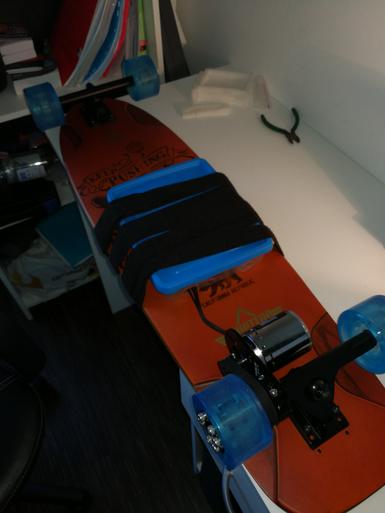

# Diy-E-Skate

This is a diy electric skateboard i designed and built a few years ago with RC-car-modelism parts.

The goal was to learn about e-transportation and also to have fun riding it ! 😉

I made a demonstration and let people testing it at the well known "Maker Faire Paris".

Here's a video of it :

         

Max speed with current batteries : 35 km/h

 
 
 

* Click on the image to see the build *

      

link --> https://youtu.be/60HYHI3BR-A

